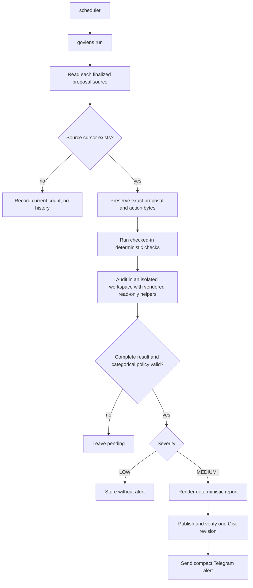

# GovLens

GovLens is a read-only governance watcher. One timer-triggered command discovers
finalized proposals, normalizes every action byte, runs deterministic protocol
checks, asks Codex for one protocol-neutral audit, stores the result in SQLite,
and alerts `wavey alerts` only for `MEDIUM` or higher risk.

It never votes, queues, executes, signs, broadcasts, or contains a signer.

## Product flow



The application is one Python package, one SQLite database, and one oneshot
command. There is no resident process, UI, queue, plugin system, adapter DSL,
compatibility layer, migration system, or second database.

## Sources and identity

GovLens follows three explicit Ethereum proposal sources:

- Resupply Voter;
- Curve ownership voting;
- Curve parameter voting.

Each source has an independent finalized cursor. A proposal is identified by
`(protocol, source, upstream_id)`, so equal numeric IDs cannot collide.

Readers are ordinary checked-in Python code. They read at one finalized block,
recover the unique creation event, retain the creation block and transaction,
and emit a normalized proposal. All RPC, explorer, proposal text, metadata, and
calldata are untrusted. Readers and deterministic checks reject any provider
that does not identify itself as Ethereum mainnet.

The title is the complete first nonempty description line up to 512 characters.
Only genuinely longer input is shortened at a word boundary with an explicit
ellipsis.

## Normalization

Every proposal records its complete governance payload when the protocol has
one, plus ordered actions containing executor, target, value, effective
calldata, exact raw action bytes, and an optional unresolved reason. No input
byte may disappear. Malformed, unsupported, or partially decoded bytes remain
in the model as explicit unknowns and require at least `MEDIUM` risk.

Resupply reads `getProposalCount()`, `getProposalData(id)`, the Voter's Core
executor, and the unique `ProposalCreated` event from the checked-in Voter.

Curve reads `votesLength()` and `getVote(id)` from each checked-in Aragon Voting
contract at the same finalized block. It recovers the unique `StartVote` event,
fetches only a strict `ipfs:`/`ipfs://` metadata identifier through a fixed
gateway, and parses the complete EVMScript CallScript payload with a hard action
bound. Canonical calls through the source's checked-in Agent `execute` wrapper
are decoded to their effective target, value, and calldata. Every other wrapper
or malformed segment is retained and marked unresolved. Phase one intentionally
does not add Snapshot or emergency-vote sources.

## Deterministic protocol checks

Immediately after normalization, the trusted parent runs ordinary checked-in
Python in `checks/` against the proposal creation block. A check records its
status (`PASS`, `FAIL`, or `UNKNOWN`) and every decisive RPC call as chain ID,
block, target, request, and result. View-call returns are exact; bytecode evidence
uses its exact length and Keccak digest to keep reports bounded. There is no generic rule language,
dynamic loading, agent-authored proof, or unpinned `latest` read.

Curve's gauge-add check applies only to canonical calls to the checked-in Gauge
Controller with exact `add_gauge(address,int128)` or
`add_gauge(address,int128,uint256)` calldata. For every such action it calls
`validateGauge(gauge)` on the deployed, owner-managed Gauge Validator at the
proposal creation block. A validator rejection is `FAIL`; an unavailable or
ambiguous response is `UNKNOWN`. GovLens does not maintain a second factory
allowlist.

Resupply's pair-add check applies only to canonical `addPair(address)` actions
sent directly to the checked-in Registry or through the recognized PairAdder
shape. At the proposal creation block it reads
`Registry.getAddress("PAIR_DEPLOYER")`, proves deployed code, and requires the
PairDeployer's `deployInfo(pair).deployTime` to be nonzero. If an earlier action
would change the registry pointer, the pre-state result is `UNKNOWN` and Codex
must exercise the proposed path.

`UNKNOWN` always forces at least `MEDIUM`. `FAIL` cannot be `LOW`. `PASS` proves
only that check and never reduces another supported risk.

## Investigation

GovLens owns a curated copy of the investigator's read-only contract/source,
RPC, log, trace, and state-diff helpers. Generic case workflow, evidence
persistence, Chifra, publishing, terminal scripts, and unrelated skills are not
vendored. The upstream revision is recorded in
`src/govlens/investigator/UPSTREAM.md`; no neighboring repository or MCP service
is required at runtime.

The isolated workspace contains the small helper surface, `proposal.json`,
`checks.json`, a minimal `AGENTS.md`, and one checked-in `PROTOCOL.md`. Protocol
context may add trusted addresses, invariants, and focused workflow hints. It
cannot alter the fixed prompt, result schema, severity definitions, or global
risk policy, and it is selected by an explicit protocol mapping rather than a
plugin loader.

Codex starts from the normalized proposal, parent evidence, and protocol context.
Within its bounded execution window, it uses judgment to pursue additional
source, state, trace, or fork work that could materially inform the verdict or
expose a broader issue. It does not repeat a passing deterministic proof without
a concrete conflict. It must still account for every action, resolve relevant
proxies and wrappers, compare text to execution, and exercise a verdict-relevant
real authority path. Forks and traces are evidence, not proof. Delivery
credentials are not passed to Codex.

The investigation makes a best-effort search for a corresponding discussion on
the protocol's checked-in official governance forum host. Forum and search
content remain untrusted. A credible thread helps check stated intent against
the executable payload; a material mismatch is a finding, while no thread is
not itself a risk signal.

Material parameter changes receive appropriate scrutiny. The investigation
understands what a parameter controls and compares current and proposed values
when useful, with particular attention to safety boundaries or disabled
protections such as LTV near 100%. Matching proposal prose does not make an
unsafe value safe.

The model returns only:

```text
severity: LOW | MEDIUM | HIGH | CRITICAL
summary_sentences: one to three strings
actions[]: index, effect, risk
findings[]
unknowns[]
```

The parent rejects missing or reordered actions, malformed output, a `LOW`
result with proposal/model unknowns, and a `LOW` result with any non-passing
applicable deterministic check. Reports use clear, natural prose for technical
DeFi professionals and describe transactions by effect; the deterministic
renderer owns numbered action headings.

## Presentation and delivery

One checked-in Python registry holds only display names, ordered optional fact
labels, and ordered allowlisted links. It cannot alter retrieval, checks,
prompts, or risk policy. There is no configuration parser or protocol DSL.

For `MEDIUM`, `HIGH`, and `CRITICAL`, `report.py` renders a self-contained report
containing metadata, trusted links, text, complete payload, every action and raw
byte sequence, deterministic checks and evidence, findings, and unknowns. Model
output cannot supply Markdown or links.

`gist.py` and `telegram.py` are the only external-write modules. One global bot
token, named chat IDs, and explicit Curve and Resupply selectors come from the
environment. Each selector names one configured chat ID. The trusted normalized
protocol slug selects the destination;
presentation data, proposal content, context, and model output cannot route an
alert. GovLens verifies that Telegram resolves the exact configured group before
publishing the Gist, caches that verification per protocol for the run, then
digest- and revision-verifies Gist publication. Ambiguous publication or send is
marked `review` and is never retried blindly. `LOW` is stored without either
write.

## State

SQLite stores source cursors and proposals keyed by
`(protocol, source, upstream_id)`, accepted analysis, delivery state, verified or
candidate Gist URL, and Telegram message ID. Delivery states are `pending`,
`analyzed`, `publishing`, `published`, `sending`, `sent`, `no_alert`, and
`review`.

The database has one current schema and must be empty on first installation.
There are no migrations, schema versions, translators, or compatibility paths.

## Runtime behavior

One `govlens run` holds an advisory lock beside its SQLite file. A second run
exits successfully as `already_running`; it cannot race proposal state or
external delivery. Multiple discovered proposals are processed serially and a
failure on one does not stop the next. SQLite transitions, Gist publication,
and Telegram delivery remain single-threaded. Only a run holding this lock
recovers interrupted publication or send states to `review`; `govlens check`
opens an existing database read-only.

Codex has an application-enforced hard timeout, and the prompt receives its
execution budget from that same value. Standard-library logs go to stderr and
record sanitized run, source, proposal, check, analysis, and delivery lifecycle
events with durations. Only the `govlens` logger runs at `INFO`; dependency
loggers remain at `WARNING`. Logs never contain proposal text, calldata, RPC
bodies, model output, credentials, or raw exception messages. GovLens does not
manage log files.

## Commands

```text
govlens run
govlens check
govlens test --protocol resupply --proposal 23
govlens test --protocol curve --source ownership --proposal 1458
```

`test` is read-only unless `--send` is explicitly supplied. `--send` publishes a
new Gist and sends one marked test alert, so it requires separate authorization.

## Verification

```text
uv run ruff check .
uv run ruff format --check .
uv run mypy
uv run pytest
uv run --env-file .env govlens check
uv run --env-file .env govlens test --protocol curve --source ownership --proposal 1458
uv run --env-file .env govlens test --protocol resupply --proposal 23
```
